# Building a site with VitePress
In this tutorial you will learn how to build a site with VitePress.

## What is VitePress?
[VitePress](https://vitepress.dev) is a modern static site generator built on Vite and Vue. It is made specifically for building content-oriented websites quickly and easily, such as documentation sites and blogs, but you can also use it for portfolios or marketing websites.

## Prerequisites
To follow along with this tutorial, you will need:
- [Node.js](https://nodejs.org/) version 18 or later installed.
- A basic understanding of the terminal ([command line basics](https://developer.mozilla.org/en-US/docs/Learn/Tools_and_testing/Understanding_client-side_tools/Command_line)).
- A text editor of your choice with Markdown support (Ill be using [Visual Studio Code](https://code.visualstudio.com/)).

Additionally, having a genuine interest in learning about web development will make this tutorial more enjoyable!

## Create a new Project
To create a new VitePress project, you first need to create a new folder. If you already have a folder set up, open it with your preferred text editor. If you don’t have one, you can create a new folder using the following command in your terminal:
```bash
mkdir my-vitepress-site
``` 
Then, navigate to the newly created folder:
```bash
cd my-vitepress-site
```
And open it with your text editor (with Visual Studio Code, you can use the following command):
```bash
code .
```
Next, you need to initialize the project. I recommend using npm for this. Run the following command in your terminal:
```bash
npm init -y
```
This will create a `package.json` file in your project folder.


Now, let’s install VitePress as a dev dependency. A dev dependency is a package that’s only needed during development. To install VitePress, run:
```bash
npm add -D vitepress
```
This will install VitePress and adds it to the `devDependencies` in your `package.json` file.

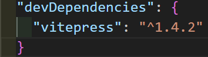

You will also see that a `node_modules` folder and a `package-lock.json` file have been created in your project folder. Dont give these files much thought, they are just files necessary for VitePress to run.

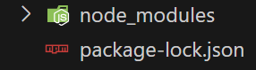

Next we will use the VitePress wizard to create a new project. Run the following command in your terminal:
```bash
npx vitepress init
```
You will be asked a few questions, such as the name of your project and the directory where you want to save it. You can use the default values by just pressing Enter.

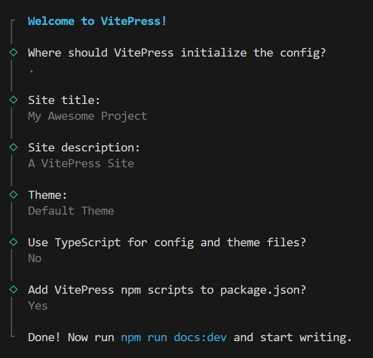

Once the wizard has finished you can start your VitePress project by running the following command in your terminal:
```bash
npm run docs:dev
```
This will start a local development server you can view your site by opening your browser and navigating to `http://localhost:5173/`.

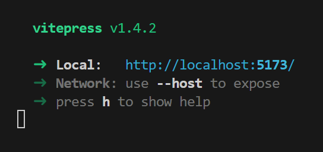

You should now see your VitePress site up and running!

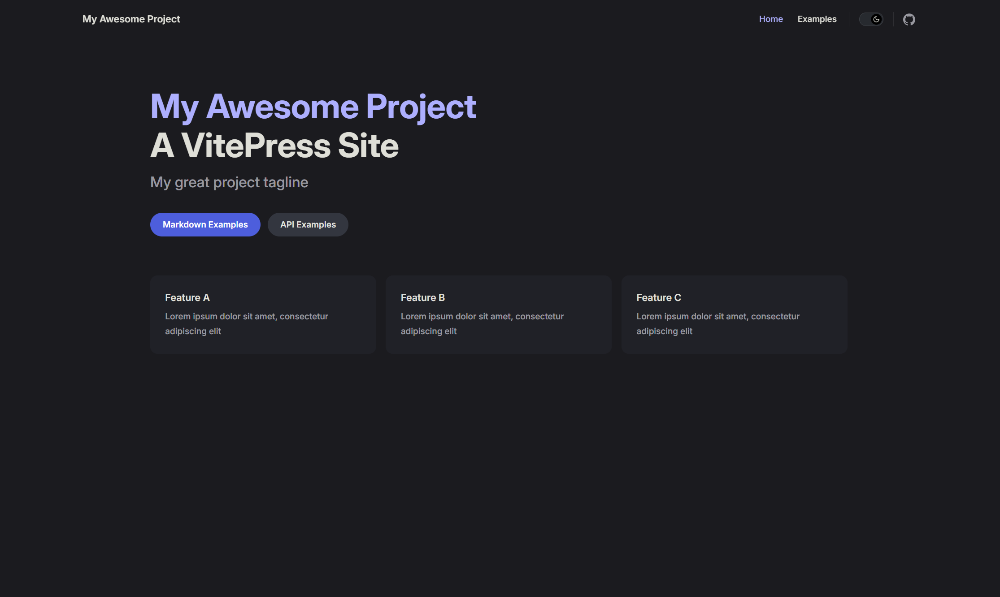

> **Note**: If at any point your site is not working as expected, you can stop the development server by pressing `Ctrl + C` in your terminal and then restart it by running `npm run docs:dev` again.

### Features Included by Default
VitePress sites comes with a few features included by default:
- Navigation bar
- Light and dark mode
- Basic layout

Now let's dive deeper and see how we can customize our site!

### Customizing the Homepage
You can customize the homepage by editing the `index.md` file. This file is written in Markdown (learn more about Markdown [here](https://www.markdownguide.org/getting-started/)).


In the `index.md` file you should see the following content:
```markdown
---
https://vitepress.dev/reference/default-theme-home-page
layout: home

hero:
  name: "My Awesome Project"
  text: "A VitePress Site"
  tagline: My great project tagline
  actions:
    - theme: brand
      text: Markdown Examples
      link: /markdown-examples
    - theme: alt
      text: API Examples
      link: /api-examples

features:
  - title: Feature A
    details: Lorem ipsum dolor sit amet, consectetur adipiscing elit
  - title: Feature B
    details: Lorem ipsum dolor sit amet, consectetur adipiscing elit
  - title: Feature C
    details: Lorem ipsum dolor sit amet, consectetur adipiscing elit
---
```

Lets first try and change the name, text and tagline of the hero section. You can do this by changing the values of the `name`, `text` and `tagline` keys in the `hero` section. For example:

```markdown
hero:
  name: "My First VitePress Project"
  text: "A VitePress Site By ..."
  tagline: "My first project tagline"
```

After you have made the changes, save the file (you can do this by pressing `Ctrl + S` on your keyboard) and refresh your browser. You should see the changes on your site!

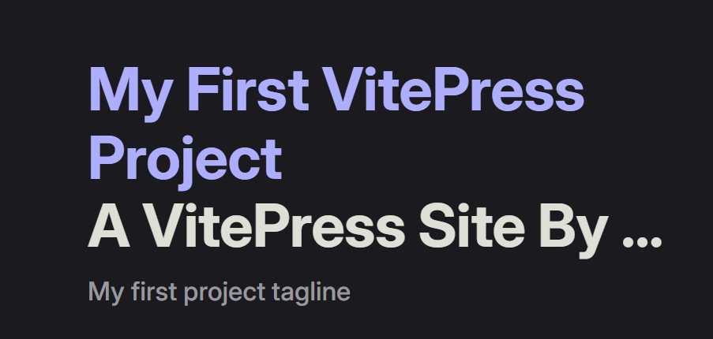

You can also add an image to the hero section. To do this, you need to add an `image` key to the `hero` section. The `image` key should have a `src` key with the path to the image and an `alt` key with the alt text for the image. For example:

```markdown
hero:
  name: "My First VitePress Project"
  text: "A VitePress Site By ..."
  tagline: "My first project tagline"
  image:
    src: /images/logo.jpg
    alt: Logo
```

Make sure you have the correct path to the image and the correct file format (in this case `.jpg`) but you can also use `.png` or `.svg` files.

After you have made the changes, save the file and refresh your browser. You should see the image on your site!

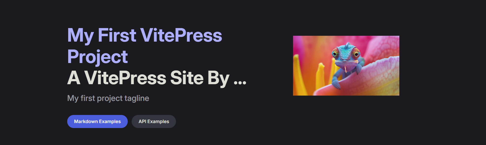

As shown in the image above there are also actions in the hero section. These are buttons that can be used to navigate to different parts of your site. These require a bit more advanced setup so we will cover them in the next section.

First lets try and change the features section. You can do this by changing the values of the `title` and `details` keys in the `features` section. By default it should look like this:

```markdown
features:
  - title: Feature A
    details: Lorem ipsum dolor sit amet, consectetur adipiscing elit
  - title: Feature B
    details: Lorem ipsum dolor sit amet, consectetur adipiscing elit
  - title: Feature C
    details: Lorem ipsum dolor sit amet, consectetur adipiscing elit
```

but you can customize the features to your liking. For example you can chnage it to what your site is about:

```markdown
features:
  - title: Fast
    details: VitePress is fast and efficient
  - title: Easy to use
    details: VitePress is easy to use and understand
  - title: Customizable
    details: VitePress is highly customizable
```

After you have made the changes, save the file and refresh your browser. You should see the changes on your site!


Now lets try and change the actions in the hero section. You can do this by changing the values of the `text` and `link` keys in the `actions` section. By default it should look like this:

```markdown
actions:
  - theme: brand
    text: Markdown Examples
    link: /markdown-examples
  - theme: alt
    text: API Examples
    link: /api-examples
```

**`theme`**: This defines the styling of the action button. You can choose between different themes, such as `brand` for primary actions and `alt` for secondary actions.

**`text`**: This is the display text for the action button. It should clearly say what the action does to encourage users to click it.

**`link`**: This is the URL path that the action button will navigate to when clicked.

You can customize the actions to your liking. For example:
```markdown
actions:
  - theme: brand
    text: Get Started
    link: /getting-started
  - theme: alt
    text: Learn More
    link: /learn-more
```

After you have made the changes, save the file. Next we will create the pages for the actions. You can do this by creating a new `.md` file in your project folder. For example, to create a new page for the `Get Started` action, create a new file called `getting-started.md`. You should always make sure that the file name is the same as the `link` value in the `index.md` file.

In the `getting-started.md` file you can add content that will be displayed on the page. For example:
```markdown
# Getting Started
Welcome to the getting started page!
```

You should be able to see the new page by clicking the `Get Started` button on your site!

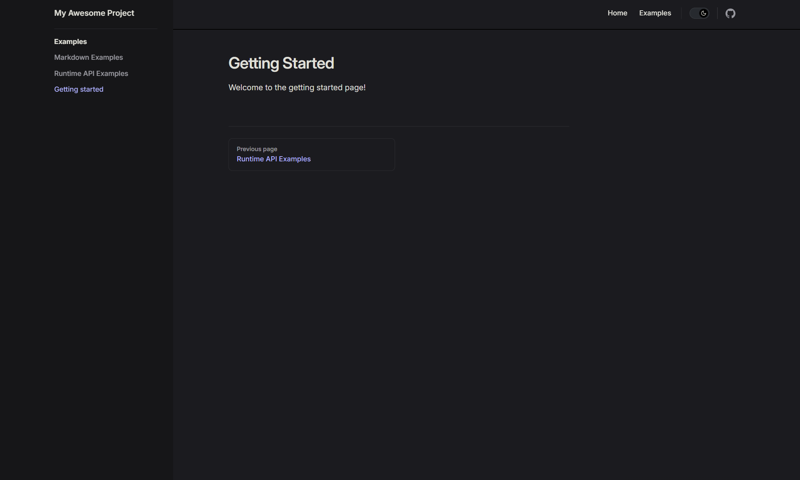

As you can see in the image above, there are links on the left side of the site, this is the navigation bar for our pages. 
>Note that the **Getting Started** link is not included by default.

To customize the navigation bar, we will need to edit the `config.mjs` file located in the `.vitepress` folder. Here’s how:

First open the `.vitepress` folder you should see this:

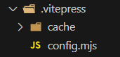

Next open the `config.mjs` file. 
> **Note**: When making changes in the `config.mjs` file, make sure to restart the development server by pressing `Ctrl + C` in your terminal and then running `npm run docs:dev` again.

```javascript
import { defineConfig } from 'vitepress'

// https://vitepress.dev/reference/site-config
export default defineConfig({
  title: "My Awesome Project",
  description: "A VitePress Site",
  themeConfig: {
    // https://vitepress.dev/reference/default-theme-config
    nav: [
      { text: 'Home', link: '/' },
      { text: 'Examples', link: '/markdown-examples' }
    ],

    sidebar: [
      {
        text: 'Examples',
        items: [
          { text: 'Markdown Examples', link: '/markdown-examples' },
          { text: 'Runtime API Examples', link: '/api-examples' }
        ]
      }
    ],

    socialLinks: [
      { icon: 'github', link: 'https://github.com/vuejs/vitepress' }
    ]
  }
})
```

Go to the sidebar section and add a new item for the **Getting Started** page. You can do this by adding a new object to the `items` array. For example:
```javascript
{ text: 'Getting started', link: '/getting-started' }
```

> **Note**: Every time you add a new item you should place a comma at the end of the previous item.

The final result should look like this:
```javascript
sidebar: [
  {
    text: 'Examples',
    items: [
      { text: 'Markdown Examples', link: '/markdown-examples' },
      { text: 'Runtime API Examples', link: '/api-examples' },
      { text: 'Getting started', link: '/getting-started' }
    ]
  }
],
```

Make sure you have the correct `text` and `link` values. After you have made the changes, save the file and refresh your browser. You should see the new link in the navigation bar!

Our site also has a header with a title and a navigation bar. 


You can customize the title by changing the value on line 5 in the `config.mjs` file. For example:
```javascript
title: "My First VitePress Project"
```

You can also customize the description by changing the value on line 6 in the `config.mjs` file. For example:
```javascript
description: "A VitePress Site By ..."
```

Now that you have added a title and description that fits your site ill show you how to customize the navigation bar. You can do this by adding new objects to the `nav` section in the `config.mjs` file. For example:
```javascript
nav: [
  { text: 'Home', link: '/' },
  { text: 'Examples', link: '/markdown-examples' },
  { text: 'Getting Started', link: '/getting-started' }
],
```
Remember to make sure you have the correct `text` and `link` values and added a comma at the end of the previous item. After you have made the changes, save the file restart your server by pressing `Ctrl + C` in your terminal and then running `npm run docs:dev`. Now navigate to your site and you should see the new title and link in the navigation bar!


## Conclusion
Now that you have seen how to customize the homepage, the navigation bar and how to add pages. You should be able to create a site with VitePress that fully fits your needs. 

<br>

## Making a portfolio with VitePress

Lets first delete the `api-examples.md` file and the `markdown-examples.md` file as we wont be needing them. You can do this by deleting the files in your project folder.

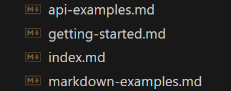

You can optionally also delete the `getting-started.md` file as we wont really be needing it either, but make sure to keep the `index.md` file. 


> **Note**: Dont delete the `index.md` file as it is the homepage of your site.

Next well go to the `config.mjs` file and delete the links that where made for the `api-examples`, `getting-started.md` and `markdown-examples` pages. When you open the `config.mjs` file you should see this:
```javascript
import { defineConfig } from 'vitepress'

export default defineConfig({
  title: "My First VitePress Project",
  description: "A VitePress Site By ...",
  themeConfig: {
    nav: [
      { text: 'Home', link: '/' },
      { text: 'Examples', link: '/markdown-examples' },
      { text: 'Getting Started', link: '/getting-started' }
    ],

    sidebar: [
      {
        text: 'Examples',
        items: [
          { text: 'Markdown Examples', link: '/markdown-examples' },
          { text: 'Runtime API Examples', link: '/api-examples' },
          { text: 'Getting started', link: '/getting-started' }
        ]
      }
    ],

    socialLinks: [
      { icon: 'github', link: 'https://github.com/vuejs/vitepress' }
    ]
  }
})
```

After deleting the links the file should look like this:
```javascript
import { defineConfig } from 'vitepress'

export default defineConfig({
  title: "My First VitePress Project",
  description: "A VitePress Site By ...",
  themeConfig: {
    nav: [
      { text: 'Home', link: '/' },
    ],

    sidebar: [
      {
        text: 'Examples',
        items: [
        ]
      }
    ],

    socialLinks: [
      { icon: 'github', link: 'https://github.com/vuejs/vitepress' }
    ]
  }
})
```

We can also change the title and description of the site to fit our portfolio. You can do this by changing the values of `title` and `description` in the `config.mjs` file. For example:
```javascript
  title: "Portofolio By (Your Name)",
  description: "Welcome to my portfolio site!",
```

Remember that after making changes in the `config.mjs` file you should restart the server by pressing `Ctrl + C` in your terminal and then running `npm run docs:dev` again.

Now that we have cleaned up the site and changed the title and description lets add some content to the homepage. You can do this by editing the `index.md` file. We will start with changing the hero section. You can do this by changing the values of the `name`, `text` and `tagline` keys in the `hero` section. For example:
```markdown
hero:
  name: "Portfolio By (Your Name)"
  text: "Welcome to my portfolio site!"
  tagline: "A portfolio site to showcase my work"
```

After you have made the changes, save the file and refresh your browser. You should see the changes on your site!

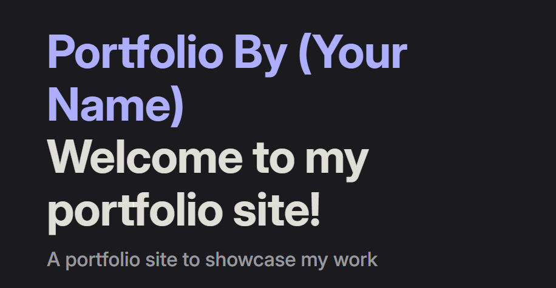

Remember when we added an image to the hero section? You can now add an image of yourself or your logo to the hero section.
```markdown
image:
    src: /images/logo.jpg
    alt: Logo
```

We will also make some changes to the actions in the hero section. You can do this by changing the values of the `text` and `link` keys in the `actions` section. For example:
```markdown
actions:
  - theme: brand
    text: My Work
    link: /my-work
```

After you have made the changes, save the file and refresh your browser.

For every action you add you should create a new `.md` file in your project folder. For example, to create a new page for the `My Work` action, create a new file called `my-work.md`. You should always make sure that the file name is the same as the `link` value in the `index.md` file.

In the `my-work.md` file you can add content that will be displayed on the page. For example:
```markdown
# My Work
Welcome to my work page!

This is where I showcase my projects and work experience.

## Projects

### Project A
This is a description of Project A.

### Project B
This is a description of Project B.
``` 

It is also possible to add a navigation item to the site. You can do this by adding new objects to the `nav` section in the `config.mjs` file. For example:
```javascript
nav: [
  { text: 'Home', link: '/' },
  { text: 'My Work', link: '/my-work' }
],
```

Next we will add some features to the homepage. You can do this by changing the values of the `title` and `details` keys in the `features` section. Here you can describe your skills or what you are passionate about. For example:
```markdown
features:
  - title: Feature A
    details: I am passionate about web development
  - title: Feature B
    details: I am skilled in HTML, CSS and JavaScript
  - title: Feature C
    details: I am a fast learner and eager to learn new things
```

Or just add some features that you think are important for your portfolio.

Last but not least you can add social links to your site. You can do this by adding new objects to the `socialLinks` section in the `config.mjs` file. For example:
```javascript
socialLinks: [
      { icon: 'github', link: 'https://github.com/vuejs/vitepress' },
      { icon: 'linkedin', link: 'https://www.linkedin.com/' },
      { icon: 'twitter', link: 'https://twitter.com/' }
    ]
```
> **Note**: Make sure to change the `link` values to your own social media profiles.


<br>

# Final Conclusion

In this tutorial, you've learned how to build and customize a VitePress site from scratch. You now know how to set up a project, install dependencies, and run a local development server. Here's a recap of the key concepts you've learned:

### 1\. Creating and Structuring Pages

-   Creating Pages: You can create new pages for your site by adding new `.md` files. These files contain the content for each page in Markdown format, which makes them easy to write and edit.

### 2\. Customizing the Navigation Bar

-   Customizing Navigation: You can update the `nav` section in the `config.mjs` file to control the links shown in the navigation bar.
-   Example: You added links such as "Home" and "My Work" to the navigation bar, allowing users to easily access the pages on your site.

### 3\. Hero Section Customization

-   Hero Section: This is the main area at the top of the homepage. You learned how to update the `name`, `text`, and `tagline` in the `index.md` file to better represent your project or portfolio.
-   Adding Images: You can also add an image to the hero section by specifying the image path in the `image` key within the `hero` section. This can be a personal logo, a project image, or anything that helps represent your site.

### 4\. Adding Action Buttons

-   Creating Actions: In the hero section, you learned how to create action buttons with custom `text` and `link` properties. These buttons can guide users to other important pages on your site, like "My Work" or "Contact".
-   Linking Action Buttons to Pages: After setting up action buttons, you created new `.md` files corresponding to each button's link. For example, clicking "My Work" would lead to the `/my-work` page.

### 5\. Modifying Features Section

-   Customizing Features: The `features` section allows you to showcase important aspects of your site or portfolio. You can modify the `title` and `details` properties to describe your skills, projects, or other key attributes.

### 6\. Updating the Configuration

-   Configuring `config.mjs`: This file holds the configuration settings for your site, including the title, description, and navigation. By editing this file, you can adjust the site's structure, navigation, and appearance.
-   Navigation: You learned how to configure the navigation for a better user experience by adding links to new pages, like "My Work".

### 7\. Adding Social Links

-   Social Links: You can include links to your social media profiles by adding new objects to the `socialLinks` section in the `config.mjs` file. This allows visitors to connect with you on various platforms.

### Final Thoughts

By understanding how to add pages, modify navigation, customize the homepage, and configure site settings in `config.mjs`, you now have the skills to create a fully customized static website with VitePress. Whether you're building a personal portfolio, a documentation site, or any other content-focused website, VitePress offers an efficient approach to web development.

With this knowledge, you can easily expand your site by adding more pages, modifying the layout, and customizing the content. `Happy building!`